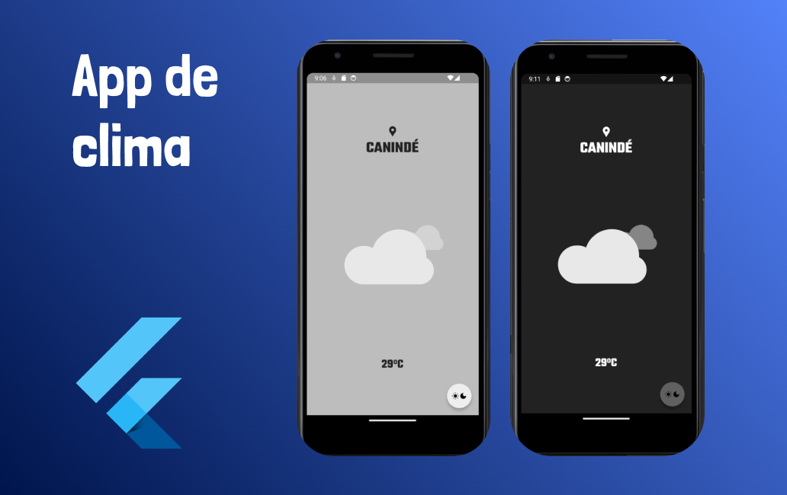

# Aplicativo de Clima - Flutter

Projeto de aplicativo de clima, feito para estudo do framework Flutter, utilizando recursos de alteração de temas e cores, capturando a localização do dispositivo do usuário.

  

## Tecnologias empregadas

- Dart
- Flutter

### Pacotes utilizados

- http
- geolocator
- geocoding
- lottie
- google_fonts
- provider

Utilizando as bibliotecas:

- [Google Fonts](https://https://fonts.google.com/)
- [Lottie](https://lottiefiles.com/)
